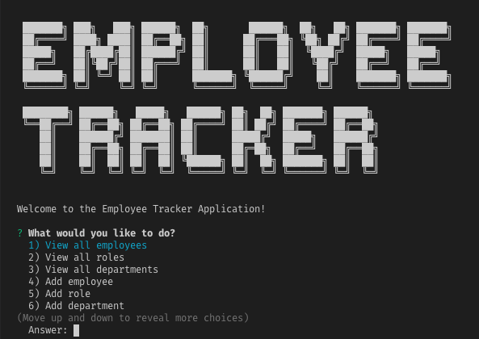
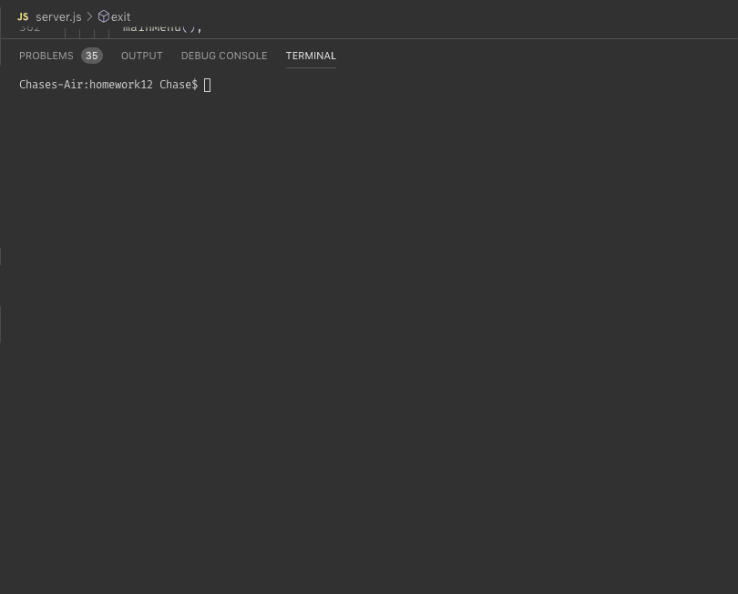

# Unit 12 MySQL Homework: Employee Tracker
- - - -
## Application
- - - -

A command-line application with the ability to view and manage departments, roles, and employees of a/your company. 

## Preview
- - - -

## Usage
- - - -
* Add departments, roles, employees

* View departments, roles, employees

* Update employee roles

## Instructions
- - - -
1. Clone the repository to your working directory. 
   1. Type `git clone` in your command line
   2. Then copy and paste `https://github.com/mr-andersen523/homework12.git`
   3. Press `enter` 
2. In your code editing terminal run `npm install`
3. After installation, run `node server.js`
   
## Demo
- - - -

